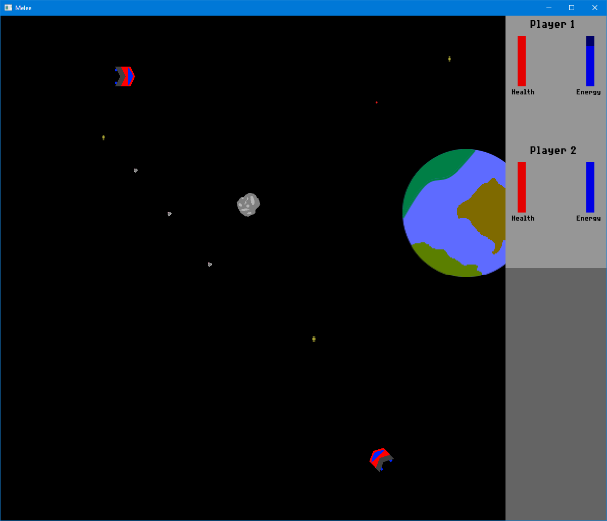

Melee
============

WARNING: This is not a game (yet?). Not playable.

This is my attempt at creating a game, since I've not done one before - I'm an
embedded systems and desktop application developer, without formal games
programming training. Good artists create, but - as is abundantly clear by the
temporary assets I MSPainted - I am not a good artist, so I'm stealing the
mechanics from [The Ur-Quan Masters](http://sc2.sourceforge.net/) project.

So far I'm using [SFML](https://www.sfml-dev.org/) for the rendering, and modern
C++ for the "engine". I'm aware better solutions exist (Unity, Godot, etc.) but
I'm using this purely as an exercise to learn how a simple game might work
under the hood.



## Building

This should be buildable under (at least) Windows and Linux.

### Windows (Visual Studio 2019)

You should be able to open the `CMakelists.txt` file as a CMake project in
Visual Studio 2019, then build from within the IDE.

Choosing the `install` option when right-clicking the top level
`CMakelists.txt` in the Solution Explorer will generate a redistributable
package on disk with all the required binaries and assets needed to run the
game.

The SFML library dependency is vendored in the repository, and statically
linked.

### Linux (GCC or Clang)

To build on Linux, install the `cmake`, `build-essential`, `ninja-build` and
`libsfml-dev` packages from your distribution's package manager as
prerequisites.

Once the prerequisites have been installed, build via:

```
cmake -B build/ -G "Ninja" .
cmake --build build

```

After building, a redistributable archive containing all the binaries and
assets needed to run the game can be make via:
```
cd build && cpack -G ZIP

```
