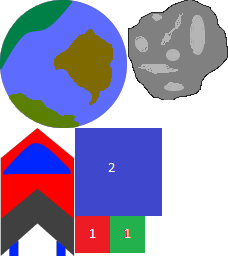

Holey Sheet
===========

This is a basic, but cross platform, command-line based sprite sheet packer -
also known as a texture atlas generator or sprite atlas generator.

It takes in several source images, then arranges them as best it can to minimize
the total amount of space used in a single combined output image. This combined
image, along with a metadata CSV file that is also generated, can then be used
to obtain the original individual source images within an application.

In game development fewer texture images are often desired; it allows for
faster asset load due to the lower overheads of loading and processing a single
file vs. many from disk, and fewer textures will often improve GPU performance.



## Building

This should be buildable under (at least) Windows and Linux.

### Windows (Visual Studio 2019)

You should be able to open the `CMakelists.txt` file as a CMake project in
Visual Studio 2019, then build from within the IDE.

Choosing the `install` option when right-clicking the top level
`CMakelists.txt` in the Solution Explorer will generate a redistributable
package on disk with all the required binaries and assets needed to run the
tool.

The SFML library dependency is vendored in the repository, and statically
linked.

### Linux (GCC or Clang)

To build on Linux, install the `cmake`, `build-essential`, `ninja-build` and
`libsfml-dev` packages from your distribution's package manager as
prerequisites.

Once the prerequisites have been installed, build via:

```
cmake -B build/ -G "Ninja" .
cmake --build build

```

After building, a redistributable archive containing all the binaries and
assets needed to run the tool can be make via:
```
cd build && cpack -G ZIP

```

### License

Released under the MIT license.

````
Permission to use, copy, modify, and distribute this software
and its documentation for any purpose is hereby granted without
fee, provided that the above copyright notice appear in all
copies and that both that the copyright notice and this
permission notice and warranty disclaimer appear in supporting
documentation, and that the name of the author not be used in
advertising or publicity pertaining to distribution of the
software without specific, written prior permission.

The author disclaims all warranties with regard to this
software, including all implied warranties of merchantability
and fitness.  In no event shall the author be liable for any
special, indirect or consequential damages or any damages
whatsoever resulting from loss of use, data or profits, whether
in an action of contract, negligence or other tortious action,
arising out of or in connection with the use or performance of
this software.
```
